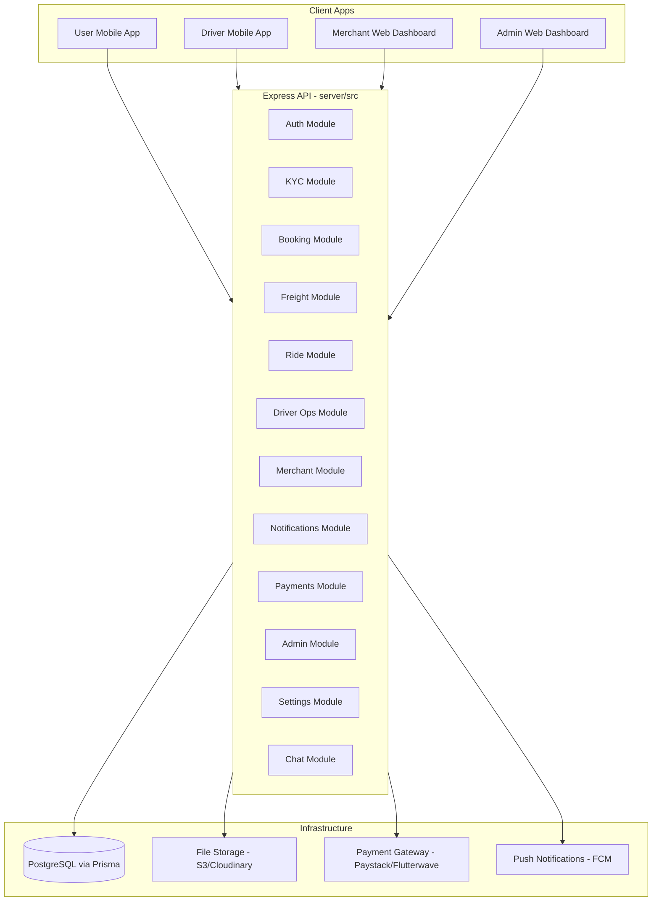

# Sayem Route - Full Backend API Plan

The design PDFs reveal 4 client portals (User mobile, Driver mobile, Merchant web, Admin web) spanning 12 functional domains. Below is every route and model required, organized into buildable phases. Auth (Phase 0) is already complete in [server/src/](server/src/).

---

## Architecture Overview

---

## Phase 0: Auth 

Already implemented in [server/src/services/auth.ts](server/src/services/auth.ts). Models: `User`, `RefreshToken`.

- `POST /api/auth/register` - local sign up
- `POST /api/auth/login` - local sign in
- `POST /api/auth/google` - Google OAuth
- `POST /api/auth/apple` - Apple OAuth
- `POST /api/auth/refresh` - refresh access token
- `POST /api/auth/logout` - invalidate refresh token
- `GET /api/auth/me` - current user profile

---

## Phase 1: File Uploads + KYC/Verification

File upload is a prerequisite for KYC. All KYC submissions go through admin review.

### New Models

- `Upload` - id, userId, url, key, mimeType, size, createdAt
- `KycSubmission` - id, userId, type (enum), status (PENDING/UNDER_REVIEW/APPROVED/REJECTED), data (JSON), rejectionReason, reviewedBy, reviewedAt
- `KycDocument` - id, submissionId, uploadId, documentType, label

### KYC Types by Account

- **Individual/Business User**: IDENTITY (NIN, Driver's License, Passport, Voter's Card), ADDRESS (proof of address + residential address), SELFIE
- **Driver**: PERSONAL_INFO (DOB, next of kin), IDENTITY (same ID types), VEHICLE (type, model, year, plate, registration paper, road worthiness, insurance, photos front/side/rear), FINANCIAL (bank account, BVN, payout schedule), BACKGROUND_CHECK, SELFIE
- **Merchant**: BUSINESS_INFO (company name, type, CAC number, address, industry), LEGAL_DOCS (CAC cert, TIN cert, owner ID, proof of address), FINANCIAL (bank name, account number, account name, bank confirmation), OPTIONAL (insurance, fleet ownership docs)

### Routes

- `POST /api/uploads` - upload file (returns URL)
- `DELETE /api/uploads/:id` - delete uploaded file
- `POST /api/kyc/submissions` - submit a KYC step (type + documents + data)
- `GET /api/kyc/submissions` - list own submissions with status
- `GET /api/kyc/submissions/:id` - get submission detail
- `GET /api/kyc/progress` - overall verification progress (% complete)

### Admin KYC Review (Phase 10 but model defined here)

- `GET /api/admin/kyc/submissions` - list all pending submissions (filtered)
- `PATCH /api/admin/kyc/submissions/:id` - approve/reject a submission

---

## Phase 2: Profile & Settings

Extends the existing User model and adds settings storage.

### New Models

- Extend `User` with: address, avatarUrl, dateOfBirth, nextOfKinName, nextOfKinPhone
- `DriverProfile` - userId, vehicleType, vehicleModel, vehicleYear, plateNumber, vehicleColor, capacity, ownershipType, driverType (LOGISTICS/RIDE_HAILING), driverCategory (for ride-hailing: ECONOMY/COMFORT/VAN/BUSINESS)
- `MerchantProfile` - userId, companyName, displayName, businessType, cacNumber, tinNumber, yearEstablished, businessAddress, logoUrl, contactPersonName, contactPersonRole, contactPersonPhone, contactPersonEmail
- `PaymentMethod` - id, userId, type (CARD/BANK_TRANSFER/CASH), bankName, accountNumber, last4, isDefault, expiresAt
- `UserSettings` - userId, pushNotifications, emailNotifications, smsNotifications, marketingUpdates, language, distanceUnit, savedHomeAddress, savedOfficeAddress

### Routes

- `GET /api/profile` - get full profile (auto-resolves driver/merchant extras)
- `PATCH /api/profile` - update profile fields
- `POST /api/profile/avatar` - upload/change profile photo
- `PATCH /api/profile/password` - change password (current + new)
- `GET /api/profile/driver` - get driver-specific profile
- `PATCH /api/profile/driver` - update driver vehicle/personal info
- `GET /api/profile/merchant` - get merchant company profile
- `PATCH /api/profile/merchant` - update merchant company info
- `GET /api/settings` - get user settings
- `PATCH /api/settings` - update settings
- `GET /api/payment-methods` - list saved payment methods
- `POST /api/payment-methods` - add payment method
- `PATCH /api/payment-methods/:id` - set default / update
- `DELETE /api/payment-methods/:id` - remove payment method

---

## Phase 3: Logistics Bookings (Core)

The primary feature: Instant Pickup (Callup) and Scheduled Dispatch (ETTO).

### New Models

- `Booking` - id, userId, merchantId (nullable), type (CALLUP/ETTO), status (enum: PENDING/QUOTED/CONFIRMED/DRIVER_ASSIGNED/EN_ROUTE_PICKUP/AT_PICKUP/LOADED/IN_TRANSIT/AT_DROPOFF/DELIVERED/CANCELLED), reference (auto-generated, e.g. ETTO-2025-114)
- `BookingPickup` - bookingId, address, contactName, contactPhone, scheduledAt (for ETTO)
- `BookingDelivery` - bookingId, address, contactName, contactPhone, sortOrder (supports multiple destinations)
- `BookingCargo` - bookingId, loadType, vehicleType, description, specialInstructions, tdoUploadId, atlUploadId, addReturnTrip, addInsurance, requirePackaging
- `BookingQuote` - bookingId, baseFee, bookingFeePercent, bookingFee, vatPercent, vat, levyPercent, levy, insurance, total, validUntil
- `BookingAssignment` - bookingId, driverId, assignedAt, assignedBy (nullable for auto)
- `BookingTimeline` - bookingId, status, timestamp, note
- `ProofOfDelivery` - bookingId, recipientSignatureUploadId, deliveryPhotoUploadId, notes

### Cost Breakdown (from designs)

- Base Fee: calculated from route/vehicle
- Booking Fee: 5%
- VAT: 7.5%
- Levy: 2%
- Insurance: optional flat fee

### Routes

- `POST /api/bookings` - create booking (callup or ETTO)
- `GET /api/bookings` - list user's bookings (with filters: status, type, search)
- `GET /api/bookings/:id` - booking detail (with timeline, assignment, quote)
- `POST /api/bookings/:id/quote` - generate/get cost estimate
- `POST /api/bookings/:id/confirm` - confirm booking (with payment method)
- `PATCH /api/bookings/:id/cancel` - cancel booking
- `GET /api/bookings/:id/track` - get live tracking data (current location, ETA, progress %)
- `GET /api/bookings/:id/timeline` - status timeline
- `GET /api/bookings/:id/receipt` - get booking receipt data
- `POST /api/bookings/:id/report` - report an issue (title, description, media)

---

## Phase 4: Freight Quotes (Air & Sea)

### New Models

- `FreightQuote` - id, userId, merchantId (nullable), mode (AIR/SEA), direction (IMPORT/EXPORT), status (PENDING/QUOTED/ACCEPTED/BOOKED/DECLINED), quoteRef (e.g. FRQ-176306698006)
- `FreightShipmentInfo` - quoteId, origin, destination, freightType, packageDescription, weightKg, shippingSpeed (STANDARD/EXPRESS), addInsurance, requireCustomsHandling, invoiceUploadId
- `FreightCostBreakdown` - quoteId, baseFreightCost, bookingFeePercent, bookingFee, levyPercent, levy, insurance, vatPercent, vat, total, estimatedDeliveryDays, validUntil
- `FreightBooking` - quoteId, bookingRef (e.g. FRB-176306852652), paymentMethod, confirmedAt

### Routes

- `POST /api/freight/quotes` - request a freight quote
- `GET /api/freight/quotes` - list user's freight quotes
- `GET /api/freight/quotes/:id` - quote detail with cost breakdown
- `POST /api/freight/quotes/:id/book` - confirm freight booking (with payment method)
- `GET /api/freight/bookings/:id/receipt` - freight booking receipt

---

## Phase 5: Ride-Hailing

### New Models

- `Ride` - id, userId, status (REQUESTED/DRIVER_ASSIGNED/DRIVER_EN_ROUTE/IN_PROGRESS/COMPLETED/CANCELLED), rideType (ECONOMY/COMFORT/VAN/BUSINESS)
- `RideRoute` - rideId, pickupAddress, pickupLat, pickupLng, dropoffAddress, dropoffLat, dropoffLng
- `RideStop` - rideId, address, lat, lng, sortOrder (max 2 stops)
- `RideEstimate` - rideId, rideType, fare, distance, estimatedMinutes, nearbyDriverCount
- `RideAssignment` - rideId, driverId, vehiclePlate, driverName, driverRating, etaMinutes
- `RideTrip` - rideId, startedAt, completedAt, actualDistance, actualDuration, paymentMethod, customerRating, customerReview

### Routes

- `POST /api/rides` - create ride request (pickup, dropoff, stops)
- `GET /api/rides/estimates` - get fare estimates for all ride types (given pickup/dropoff)
- `POST /api/rides/:id/confirm` - confirm ride with selected type + payment method
- `GET /api/rides/:id` - ride detail (driver info, ETA, status)
- `GET /api/rides/:id/track` - live trip tracking
- `POST /api/rides/:id/cancel` - cancel ride
- `POST /api/rides/:id/rate` - rate completed ride
- `POST /api/rides/:id/share` - generate trip share link

---

## Phase 6: Driver Operations

### New Models

- `DriverStats` - driverId, totalTrips, totalEarnings, rating, reviewCount, onTimeRate, completionRate
- `DriverEarnings` - driverId, date, grossEarnings, platformFeePercent, platformFee, tips, netEarnings
- `DriverPayout` - id, driverId, amount, status (PENDING/PAID), bankAccountId, scheduledDate, paidAt
- `DriverWallet` - driverId, balance, pendingPayout

### Routes

- `GET /api/driver/dashboard` - dashboard stats (earnings, trips, active delivery, rating)
- `GET /api/driver/jobs/available` - available jobs (filtered: category, sort by pay/closest/newest)
- `GET /api/driver/jobs/available/:id` - job detail
- `POST /api/driver/jobs/:id/accept` - accept job
- `POST /api/driver/jobs/:id/decline` - decline job
- `GET /api/driver/jobs/active` - current active job
- `PATCH /api/driver/jobs/:id/status` - update job status (enroute_pickup, at_pickup, loaded, enroute_delivery, at_dropoff)
- `POST /api/driver/jobs/:id/proof-of-delivery` - submit POD (signature, photo, notes)
- `POST /api/driver/jobs/:id/complete` - mark delivery complete (for ride-hailing)
- `GET /api/driver/jobs/history` - completed/cancelled jobs
- `GET /api/driver/jobs/history/:id` - past job detail
- `GET /api/driver/earnings` - earnings summary (today, week, month) + chart data
- `GET /api/driver/earnings/payouts` - payout history
- `GET /api/driver/earnings/trips` - recent trip earnings
- `POST /api/driver/wallet/withdraw` - request withdrawal

---

## Phase 7: Notifications & Chat

### New Models

- `Notification` - id, userId, title, message, type (BOOKING/PAYMENT/OFFER/KYC/SYSTEM/JOB), isRead, data (JSON), createdAt
- `ChatRoom` - id, bookingId, participants (userId[])
- `ChatMessage` - id, roomId, senderId, message, createdAt

### Routes

- `GET /api/notifications` - list notifications (filtered by category)
- `PATCH /api/notifications/:id/read` - mark as read
- `PATCH /api/notifications/read-all` - mark all as read
- `DELETE /api/notifications/:id` - delete notification
- `GET /api/chat/rooms` - list chat rooms
- `GET /api/chat/rooms/:id/messages` - get messages in room
- `POST /api/chat/rooms/:id/messages` - send message

*Note: Real-time chat and live tracking will need WebSocket/Socket.IO, which can be layered on later.*

---

## Phase 8: Merchant Operations (Web Dashboard)

### New Models

- `MerchantTeamMember` - id, merchantId, name, email, role (ADMIN/MANAGER/DISPATCHER/ACCOUNTANT/VIEWER), status, invitedAt
- `MerchantVehicle` - id, merchantId, vehicleNumber, vehicleType, driverId (nullable), driverName, driverEmail, registrationCode, status (ACTIVE/MAINTENANCE/INACTIVE)
- `SavedRoutePricing` - id, merchantId, vehicleType, pickupCity, dropoffCity, basePrice, perKmRate, waitingTimeCharge, autoApply
- `Invoice` - id, merchantId, bookingId, customerId, invoiceNumber, status (DRAFT/AWAITING_PAYMENT/PAID/OVERDUE/CANCELLED), subtotal, vat, levy, serviceCharge, total, dueDate, paidAt, lockedBy
- `InvoiceLineItem` - id, invoiceId, description, quantity, unitPrice, total

### Routes

**Merchant Dashboard**

- `GET /api/merchant/dashboard` - stats (revenue, deliveries, vehicles, on-time rate, charts)

**Shipments**

- `GET /api/merchant/shipments` - list all shipments (filtered: status, search)
- `GET /api/merchant/shipments/:id` - shipment detail

**Bookings**

- `GET /api/merchant/bookings` - list customer bookings
- `GET /api/merchant/bookings/:id` - booking detail
- `POST /api/merchant/bookings/:id/assign-driver` - assign driver to booking
- `GET /api/merchant/bookings/:id/available-drivers` - list available drivers for assignment

**Get ETTO (Create Bookings)**

- `POST /api/merchant/etto` - create ETTO/Callup request (same shape as user booking but merchant context)
- `POST /api/merchant/etto/:id/estimate` - get cost estimate
- `POST /api/merchant/etto/:id/confirm` - confirm booking

**Fleet**

- `GET /api/merchant/fleet` - list vehicles + stats
- `POST /api/merchant/fleet` - add vehicle
- `PATCH /api/merchant/fleet/:id` - update vehicle
- `DELETE /api/merchant/fleet/:id` - remove vehicle

**Team**

- `GET /api/merchant/team` - list team members
- `POST /api/merchant/team` - invite member
- `PATCH /api/merchant/team/:id` - update member (role, status)
- `DELETE /api/merchant/team/:id` - remove member
- `GET /api/merchant/team/roles` - list roles with permissions
- `GET /api/merchant/team/activity` - activity log

**Saved Routes & Pricing**

- `GET /api/merchant/pricing` - list saved route pricing
- `POST /api/merchant/pricing` - create pricing config
- `PATCH /api/merchant/pricing/:id` - update pricing
- `DELETE /api/merchant/pricing/:id` - delete pricing

**Invoices**

- `GET /api/merchant/invoices` - list invoices (filtered)
- `GET /api/merchant/invoices/:id` - invoice detail
- `POST /api/merchant/invoices` - create invoice for a booking
- `POST /api/merchant/invoices/:id/send` - send invoice to customer
- `GET /api/merchant/invoices/:id/preview` - preview invoice
- `GET /api/merchant/invoices/:id/pdf` - download PDF

**Payouts**

- `GET /api/merchant/payouts` - payout overview (revenue, pending, paid)
- `GET /api/merchant/payouts/drivers` - driver payouts list
- `GET /api/merchant/payouts/drivers/:id` - driver payout detail
- `POST /api/merchant/payouts/process` - process selected payouts
- `GET /api/merchant/payouts/history` - payout history

**Analytics**

- `GET /api/merchant/analytics` - performance metrics (vehicle, revenue, driver, trends)

---

## Phase 9: Payments & Transactions

### New Models

- `Payment` - id, invoiceId, bookingId, userId, amount, gateway (PAYSTACK/FLUTTERWAVE/BANK_TRANSFER/CASH), gatewayRef, status (PENDING/SUCCESSFUL/FAILED), paidAt
- `PaymentHistory` - id, userId, paymentId, description, amount, date

### Routes

- `POST /api/payments/initialize` - initialize payment (returns gateway URL/reference)
- `POST /api/payments/verify` - verify payment (webhook or poll)
- `POST /api/payments/webhook/paystack` - Paystack webhook
- `POST /api/payments/webhook/flutterwave` - Flutterwave webhook
- `GET /api/payments/history` - user's payment history

---

## Phase 10: Admin Platform

All routes prefixed with `/api/admin/` and protected by admin role middleware.

### New Models

- `AdminUser` - extends User with admin role (SUPER_ADMIN/ADMIN/FINANCE/SUPPORT/OPERATIONS)
- `SupportTicket` - id, submittedBy, category, subject, description, priority, status, assignedTo, bookingId, internalNotes, createdAt, updatedAt
- `TicketNote` - id, ticketId, authorId, content, createdAt
- `AuditLog` - id, userId, role, category, action, details, ipAddress, status (SUCCESS/FAILED), timestamp
- `FraudAlert` - id, type, targetUserId, targetUserType, description, relatedData, riskLevel, status, investigatorId, notes, detectedAt
- `RoutePricingTemplate` - id, from, to, vehicleType, minPrice, maxPrice, distance
- `SystemSetting` - key, value, updatedBy, updatedAt

### Routes

**Dashboard**

- `GET /api/admin/dashboard` - platform-wide stats

**User Management**

- `GET /api/admin/users` - list users (filtered: status, KYC, state)
- `GET /api/admin/users/:id` - user profile (bookings, payments, disputes)
- `PATCH /api/admin/users/:id/suspend` - suspend user
- `PATCH /api/admin/users/:id/activate` - reactivate user

**Merchant Management**

- `GET /api/admin/merchants` - list merchants (filtered)
- `GET /api/admin/merchants/:id` - merchant profile (route pricing, activity)
- `GET /api/admin/merchants/:id/documents` - view KYC documents
- `PATCH /api/admin/merchants/:id/suspend` - suspend merchant
- `GET /api/admin/merchants/:id/pricing-activity` - pricing changes (flagged)
- `PATCH /api/admin/merchants/:id/pricing/:priceId/approve` - approve price change
- `PATCH /api/admin/merchants/:id/pricing/:priceId/reject` - reject price change

**Driver Management**

- `GET /api/admin/drivers` - list drivers (filtered: status, vehicle, assignment)
- `GET /api/admin/drivers/:id` - driver profile (docs, vehicle, history, performance)
- `PATCH /api/admin/drivers/:id/suspend` - suspend driver
- `POST /api/admin/drivers/:id/reassign` - reassign current delivery

**KYC Review** (defined in Phase 1)

- `GET /api/admin/kyc/submissions`
- `PATCH /api/admin/kyc/submissions/:id`

**Logistics Bookings**

- `GET /api/admin/bookings` - all logistics bookings (filtered)
- `GET /api/admin/bookings/:id` - booking detail (with tracking + invoice)

**Freight Quotes**

- `GET /api/admin/freight/quotes` - all freight quotes (filtered: mode, status)
- `GET /api/admin/freight/quotes/:id` - quote detail (breakdown, timeline)
- `POST /api/admin/freight/quotes/:id/notify` - send notification to merchant

**Ride Bookings**

- `GET /api/admin/rides` - all rides (filtered: status, city)
- `GET /api/admin/rides/:id` - ride detail (participants, timeline)
- `POST /api/admin/rides/:id/intervene` - admin intervention
- `POST /api/admin/rides/:id/reassign` - reassign driver
- `POST /api/admin/rides/:id/cancel` - force cancel

**Invoices & Payments**

- `GET /api/admin/invoices` - all invoices (filtered)
- `GET /api/admin/invoices/:id` - invoice detail (with audit trail)
- `PATCH /api/admin/invoices/:id/lock` - lock invoice
- `GET /api/admin/payments` - all payment transactions
- `GET /api/admin/payments/:id` - payment detail

**Route & Pricing Oversight**

- `GET /api/admin/pricing/templates` - global pricing templates
- `POST /api/admin/pricing/templates` - create template
- `PATCH /api/admin/pricing/templates/:id` - edit template
- `GET /api/admin/pricing/merchant-routes` - all merchant route pricing (with deviation %)
- `GET /api/admin/pricing/alerts` - abnormal pricing alerts
- `PATCH /api/admin/pricing/routes/:id/review` - approve/flag pricing

**Notifications**

- `GET /api/admin/notifications` - platform notifications (filtered: category, priority, status)
- `GET /api/admin/notifications/:id` - notification detail
- `POST /api/admin/notifications/send` - send notification to user/group

**Staff & Roles**

- `GET /api/admin/staff` - list admin staff
- `POST /api/admin/staff` - add staff member
- `GET /api/admin/staff/:id` - staff profile
- `PATCH /api/admin/staff/:id` - update staff (role, status)
- `POST /api/admin/staff/:id/reset-password` - reset password
- `PATCH /api/admin/staff/:id/deactivate` - deactivate
- `GET /api/admin/roles` - list roles with permissions
- `PATCH /api/admin/roles/:id` - update role permissions

**Analytics**

- `GET /api/admin/analytics/overview` - KPIs (users, revenue, bookings, drivers)
- `GET /api/admin/analytics/merchants` - top merchants
- `GET /api/admin/analytics/drivers` - top drivers
- `GET /api/admin/analytics/vehicles` - vehicle distribution & performance
- `GET /api/admin/analytics/revenue` - revenue breakdown (by type, user, payment method)
- `GET /api/admin/analytics/user-growth` - user acquisition trends
- `GET /api/admin/analytics/regional` - performance by region

**Payouts**

- `GET /api/admin/payouts` - payout management (drivers)
- `GET /api/admin/payouts/drivers/:id` - driver payout detail
- `POST /api/admin/payouts/process` - process payout batch

**Support & Disputes**

- `GET /api/admin/tickets` - all support tickets (filtered)
- `GET /api/admin/tickets/:id` - ticket detail
- `PATCH /api/admin/tickets/:id/assign` - assign to agent
- `PATCH /api/admin/tickets/:id/status` - update status
- `POST /api/admin/tickets/:id/notes` - add internal note
- `GET /api/admin/users/:id/disputes` - user's disputes
- `PATCH /api/admin/users/:id/disputes/:disputeId/resolve` - resolve dispute

**Audit Logs**

- `GET /api/admin/audit-logs` - full audit trail (filtered)
- `GET /api/admin/audit-logs/:id` - log detail

**Fraud Monitor**

- `GET /api/admin/fraud/alerts` - fraud alerts (filtered: type, level, status)
- `GET /api/admin/fraud/alerts/:id` - alert detail
- `PATCH /api/admin/fraud/alerts/:id/investigate` - start investigation
- `PATCH /api/admin/fraud/alerts/:id/resolve` - resolve alert
- `PATCH /api/admin/fraud/alerts/:id/false-positive` - mark false positive
- `POST /api/admin/fraud/alerts/:id/flag-account` - flag user account
- `POST /api/admin/fraud/alerts/:id/notes` - add investigation notes

**System Settings**

- `GET /api/admin/settings` - all system settings
- `PATCH /api/admin/settings/payment-gateway` - configure Stripe/Paystack
- `PATCH /api/admin/settings/service-fees` - booking fee %, levy, driver commission
- `PATCH /api/admin/settings/tax` - VAT %, tax ID, regional rates
- `PATCH /api/admin/settings/notifications` - notification triggers
- `PATCH /api/admin/settings/maintenance` - maintenance mode toggle
- `POST /api/admin/settings/force-logout` - terminate all sessions

---

## Prisma Schema Summary (new models count)

The current schema has `User`, `RefreshToken`. The full platform needs approximately 35+ models. Key additions grouped by phase:

- **Phase 1**: Upload, KycSubmission, KycDocument
- **Phase 2**: DriverProfile, MerchantProfile, PaymentMethod, UserSettings
- **Phase 3**: Booking, BookingPickup, BookingDelivery, BookingCargo, BookingQuote, BookingAssignment, BookingTimeline, ProofOfDelivery, BookingIssueReport
- **Phase 4**: FreightQuote, FreightShipmentInfo, FreightCostBreakdown, FreightBooking
- **Phase 5**: Ride, RideRoute, RideStop, RideEstimate, RideAssignment, RideTrip
- **Phase 6**: DriverStats, DriverEarnings, DriverPayout, DriverWallet
- **Phase 7**: Notification, ChatRoom, ChatMessage
- **Phase 8**: MerchantTeamMember, MerchantVehicle, SavedRoutePricing, Invoice, InvoiceLineItem
- **Phase 9**: Payment, PaymentHistory
- **Phase 10**: SupportTicket, TicketNote, AuditLog, FraudAlert, RoutePricingTemplate, SystemSetting

---

## Middleware Needed

- `authenticate` (DONE) - JWT verification
- `authorize(...roles)` - role-based access (individual, driver, merchant, admin, super_admin)
- `merchantMember(...permissions)` - merchant team permission check
- `adminRole(...roles)` - admin role check (SUPER_ADMIN, ADMIN, FINANCE, SUPPORT, OPERATIONS)
- `auditLog` - auto-log admin actions
- `rateLimit` - per-endpoint rate limiting

---

## Suggested Build Order

Build phases sequentially, each producing a working API increment the mobile/web apps can integrate against:

1. **Phase 1** (KYC) + **Phase 2** (Profile/Settings) - completes the user onboarding flow
2. **Phase 3** (Logistics Bookings) - the core product, enables booking + tracking
3. **Phase 4** (Freight) - extends to international shipping
4. **Phase 5** (Rides) - ride-hailing feature
5. **Phase 6** (Driver Ops) - driver-side API for accepting/managing jobs
6. **Phase 7** (Notifications + Chat) - real-time communication layer
7. **Phase 8** (Merchant) - merchant web dashboard backend
8. **Phase 9** (Payments) - payment gateway integration
9. **Phase 10** (Admin) - admin platform (largest phase, can be sub-phased)

